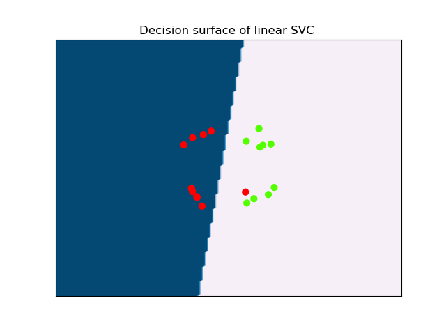
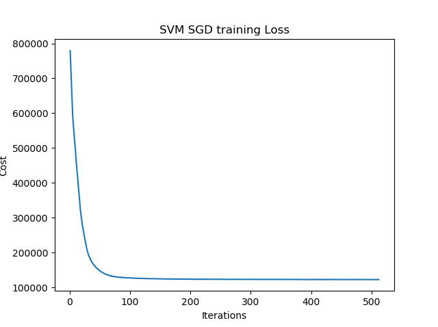

# Stochastic Gradient Descent (SGD)

Since SGD uses only one sample per iteration, the computation complexity for each iteration is $O(D)$ where $D$ is the number of features. When the number of samples $N$ is large, the update rate for each iteration of SGD is much faster than that of batch gradient descent.

SGD increases the overall optimization efficiency at the expense of more iterations, but the increased iteration number is insignificant compared with the high computation complexity caused by large numbers of samples. It is possible to use only thousands of samples overall to get the optimal solution even when the sample size is hundreds of thousands. Therefore, compared with batch methods, SGD can effectively reduce the computational complexity and accelerate convergence

SGD’s oscillations introduced by random selection enables it to jump to new and potentially better local minima. On the other hand, the gradient direction oscillates, which may lead to the problem of non-converging - as SGD will keep overshooting. However, it has been shown that when we slowly decrease the learning rate, SGD shows the same convergence behaviour as batch gradient descent. Nevertheless, further optimization algorithms based on variance reduction were proposed to improve the convergence rate.


## Requirements to run the code

* Matplotlib
* Numpy
* Scikit-learn

## Usage

```$ python train_svm.py --epochs=100 --alpha=0.000001 --regularization_strength=10000.0```

## Results

```
Training started...                                                                                                     Epoch is: 1 and Cost is: 754407.8195154738                                                                              Epoch is: 2 and Cost is: 708819.7232919635                                                                              Epoch is: 4 and Cost is: 617653.7651782469                                                                              Epoch is: 8 and Cost is: 516230.94639430585                                                                             Epoch is: 16 and Cost is: 349757.12685772                                                                               Epoch is: 32 and Cost is: 188548.63399060527                                                                            Epoch is: 64 and Cost is: 135125.1178263414                                                                             Epoch is: 128 and Cost is: 125230.5426937045                                                                            Epoch is: 256 and Cost is: 123151.89976179479                                                                           Epoch is: 512 and Cost is: 122311.55988889028                                                                           Training finished.                                                                                                      Testing...                                                                                                              accuracy on test dataset: 0.95
```
## Decision boundaries



## Tranining loss

